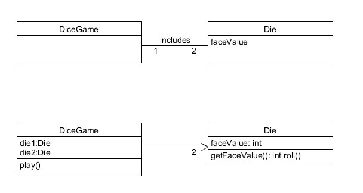
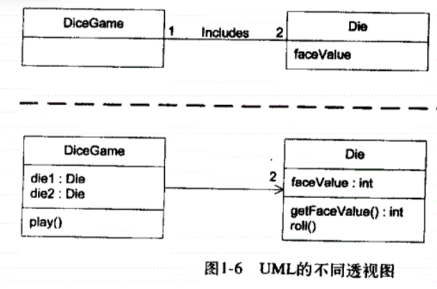

## HW2

#### 1、简答题

##### 1.1 用简短的语言给出对分析、设计的理解

分析是将复杂的话题或事物逐渐拆分的过程，以此来达到对话题更好的理解。

设计就是设想和计划。

##### 1.2 用一句话描述面向对象的分析与设计的优势

对象易于理解和抽象，面向对象很容易把现实世界反映到计算机领域，从而方便设计。

##### 1.3 简述 UML（统一建模语言）的作用。考试考哪些图？

* 作用
  * **需求分析人员（BA）**用其可以绘制用例图等，可以用于和业务沟通需求。
  * **软件设计人员（SA）**可以用其绘制活动图、顺序图、类图等用于做概要设计、详细设计。
  * **软件开发人员（SE）**也需要知道UML，至少要看懂设计人员的设计文档。

* 常用图
  * 结构图：
    * 类图
    * 对象图
    * 构件图
    * 部署图
    * 包图
  * 行为图
    * 活动图（流程图）
    * 状态机图（状态流程图）
    * 顺序图
    * 通信图
    * 用例图
    * 时序图

##### 1.4 从软件本质的角度，解释软件范围（需求）控制的可行性

#### 2、项目管理实践

##### 1.1 看板使用练习（提交看板执行结果贴图，建议使用 Git project）

- 使用截图工具（png格式输出），展现你团队的任务 Kanban
- 每个人的任务是明确的。必须一周后可以看到具体结果
- 每个人的任务是1-2项
- 至少包含一个团队活动任务

##### 1.2 UML绘图工具练习（提交贴图，必须使用 UMLet）

（

参考书UML和模式应用（中文第三版）第一章节第9页图1-6 UML的不同透视图）

[back](./)