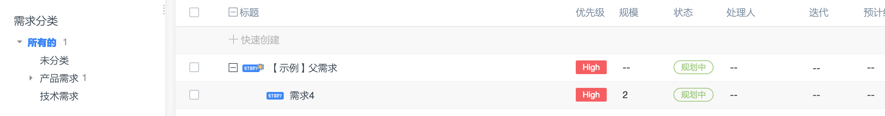
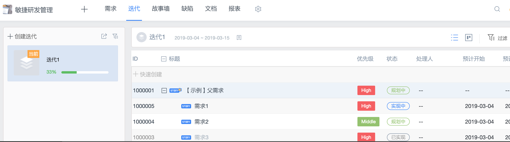
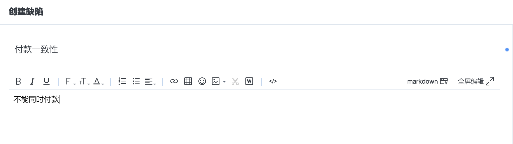
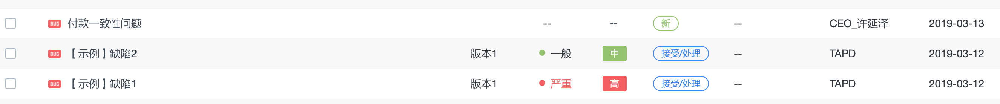
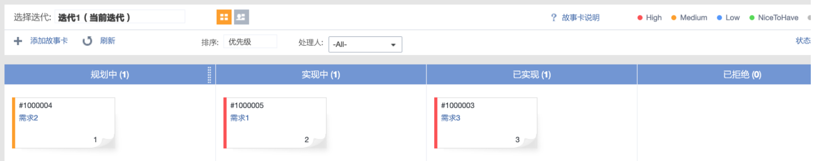
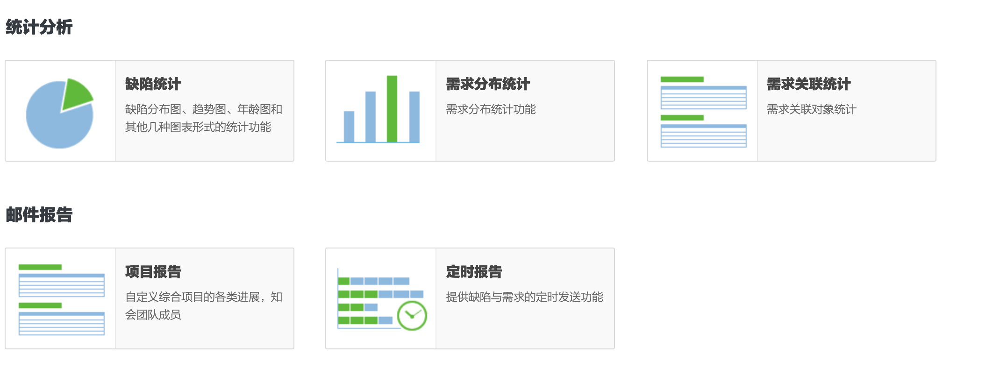

## HW3

#### 1、简答题

##### 1.1 简述瀑布模型、增量模型、螺旋模型（含原型方法）的优缺点

* 瀑布模型的优点
  * 有利于大型软件开发过程中人员的组织、管理，有利于软件开发方法和工具的研究，从而提高了大型软件项目开发的质量和效率
* 瀑布模型的缺点
  * 开发过程一般不能逆转，否则代价太大
  * 实际的项目开发很难严格按该模型进行
  * 客户往往很难清楚地给出所有的需求，而该模型却要求如此
  * 软件的实际情况必须到项目开发的后期客户才能看到，这要求客户有足够的耐心

* 增量模型的优点
  * 采用增量模型的优点是人员分配灵活，刚开始不用投入大量人力资源
  * 如果核心产品很受欢迎，则可增加人力实现下一个增量
  * 可先发布部分功能给客户，对客户起到镇静剂的作用

- 增量模型的缺点
  - 并行开发构件有可能遇到不能集成的风险，软件必须具备开放式的体系结构

* 螺旋模型（含原型方法）的优点： 
  * 设计上的灵活性,可以在项目的各个阶段进行变更
  * 以小的分段来构建大型系统,使成本计算变得简单容易
  * 客户始终参与每个阶段的开发,保证了项目不偏离正确方向以及项目的可控性
  * 随着项目推进,客户始终掌握项目的最新信息 , 从而他或她能够和管理层有效地交互
  * 可以得到比较良好的需求定义，容易适应需求的变化
  * 有利于开发与培训的同步

* 螺旋模型（含原型方法）的缺点：
  * 此啊用螺旋模型需要具有相当丰富的风险评估经验和专门知识，在风险较大的开发项目中，如果未能及时标识风险，势必造成重大损失
  * 过多的迭代次数会增加开发成本，延迟提交时间
  * 不利于开发人员的创新
  * 准确的原型设计比较困难

##### 1.2 简述统一过程三大特点，与面向对象的方法有什么关系？

* 特点：
  * scalable（伸缩性）：不需要用过程中的全部框架，只需要选择其中有效的部分。
  * effective（有效性）：可以成功的受用在一个大型项目上。
  * improves productivity（提高生产率）：通过使用实用方法来提高生产率。

利用统一过程，可以完成面向对象项目。

##### 1.3 简述统一过程四个阶段的划分准则是什么？每个阶段关键的里程碑是什么？

四个阶段分别为初始阶段 (Inception)、精化阶段 (Elaboration)、构建阶段(Construction) 和产品交付阶段 (Transition)。

每个阶段结束于一个主要的里程碑 (Major Milestone)，并在阶段结尾执行一次评估以确定这个阶段的目标是否已经满足。如果评估结果令人满意的话，可以允许项目进入下一个阶段。因此将阶段进行了划分。

分成别分别为：生命周期目标里程碑、生命周期体系结构里程碑、初始运行能力标里程碑、产品发布里程碑

##### 1.4 软件企业为什么能按固定节奏生产、固定周期发布软件产品？它给企业项目管理带来哪些好处？

每个阶段的历程碑是迭代的结束，而每一个迭代过程都有固定的长度和产品的产生，因此企业在企业在使用UP时依据各个迭代过程可以有固定的节奏生产、固定时间发布软件产品。

#### 2、实践题

- 下载腾讯微信企业版PC端，安装腾讯敏捷产品研发平台（TAPD），并了解最佳事件

  下面项目为安装之后自带的敏捷开发实例项目。

  - 比较完善 backlog 支持（树结构）

    需求Backlog是产品待实现的需求列表,Backlog中的需求按照对用户的价值排序。为每个需求按照用户价值划分优先级并且将需求进行拆分，拆分到以用户角度可接受的最小颗粒度功能作为子需求，子需求是可以规划到迭代中的需求。

    

  - 迭代（sprint）安排

    迭代是指把一个复杂且开发周期很长的开发任务，分解为很多小周期可完成的任务，这样的一个周期就是一次迭代的过程；同时每一次迭代都可以生产或开发出一个可以交付的软件产品。

    

  - 较好的缺陷管理

    创建缺陷

    

    查看缺陷

    

  - Kanban

    通过看板观察迭代进度。

    

  - 统计

    通过统计功能查看各种类型的报表

    

    并且能够按照提供不同显示方法。

    

[back](./)

