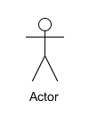
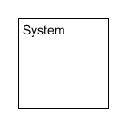
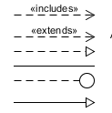
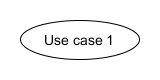
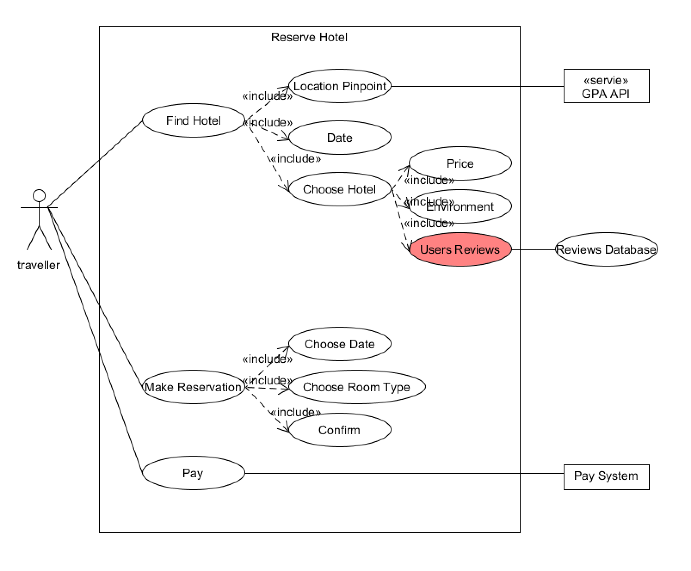
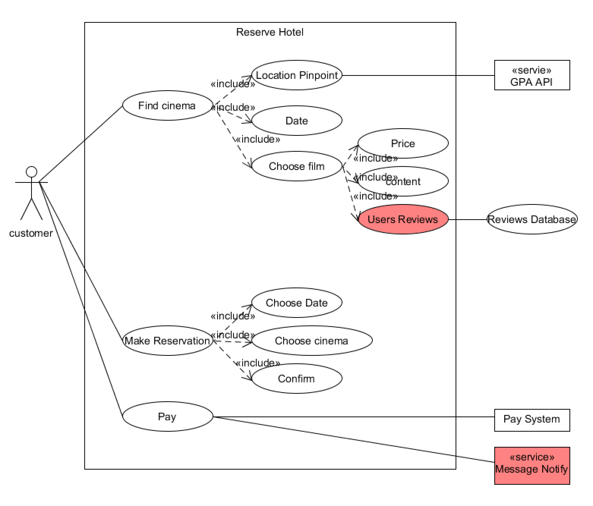

## HW4

#### 1、简答题

##### 1.1 用例的概念

**用例**（英语：**use case**），或译**使用案例**、**用况**，是软件工程中对系统如何反应外界请求的描述，是一种通过用户的使用场景来获取需求的技术。

##### 1.2 用例和场景的关系？什么是主场景或 happy path？

每个用例具有一个或多个场景，场景说明了系统是如何和最终用户或其它系统互动，也就是谁可以用系统做什么，从而获得一个明确的业务目标。

happy path 是没有异常或错误情况下的默认方案。简单的说就是happy path功能没有导致一个错误，能让执行继续，成功结束，产生一个正常的回应。

##### 1.3 用例有哪些形式？

* 摘要

  摘要用例有很少的句子组成来总结的用例。它十分适合在电子表格中计划软件开发。一个摘要用例能够简单插入电子表格的单元格中并且用表格中的其它列记述业务优先级，技术复杂度，版本号等。

* 完整正式

  一个完整正式或者复杂的用例是一个以包含了不同部分的长模板为基础的正规的文档。

* 非正式

  一个非正式的用例由文本段落组成，包括了上面提到的那些列，用总结或故事的形式详细的描述了用例。

##### 1.4 对于复杂业务，为什么编制完整用例非常难？

每个用例集中描述如何获得一个业务目标或任务。从传统的软件工程视角来看，用例只是描述了系统的一个特征。所以对大部分软件项目来说，这就意味着需要很多（有可能是数十个）用例来完整的描述新系统。一个特殊软件项目的正规度和项目的不同阶段将会影响每一用例需要的详细程度。

##### 1.5 什么是用例图？

用例图（use case diagram）是用户与系统交互的最简表示形式，展现了用户和与他相关的用例之间的关系。通过用例图，人们可以获知系统不同种类的用户和用例。

##### 1.6 用例图的基本符号与元素？

用例图由参与者（Actor）、用例（Use Case）、系统边界、箭头组成，用画图的方法来完成。用例描述用来详细描述用例图中每个用例，用文本文档来完成，以及由箭头所组成的各种关系，包括泛化，包含，扩展等。具体的用法如下图：

**参与者**

**系统边界**

**箭头**

**用例**

##### 1.7 用例图的画法与步骤

1. 确定研讨的系统
  使用用例图 System框 表示一个待研究的系统

2. 识别Actors
  识别使用系统的主要参与者（primary actors）/角色(roles)，使用用例图 actor符号 表示，通常放在系统的左边

3. 识别系统依赖的外部系统
  使用用例图 Neighboursystem框 表示用例依赖的外部系统、服务、设备，并使用构造型（Stereotype）识别

4. 识别用例（服务）
  识别用户级别用例（user goal level）
  识别子功能级别的用例（sub function level）

5. 建立Actor和Use Cases之间的关联

  使用无方向连线，表示两者之间是双向交互的协议

##### 1.8 用例图给利益相关人与开发者的价值有哪些？

- 明确系统的业务范围、服务对象（角色）、外部系统与设备
- 帮助识别技术风险，提前实施关键技术原型公关与学习
- 易于评估项目工作量，合理规划迭代周期，规划人力需要

#### 2、建模练习题（用例模型）

订酒店

订电影票

（红色是创新部分）

##### 2.1 为什么相似系统的用例图是相似的？

应为大部分系统都有同样相同的功能，功能是由需求决定，也就是说需求也类似，因此用例图也相似。

##### 2.2 如果是定旅馆业务，请对比 Asg_RH 用例图，简述如何利用不同时代、不同地区产品的用例图，展现、突出创新业务和技术

1. 可以通过评价系统来使得质量好的酒店被更多人知道
2. 通过地图API更好地确定位置
3. 支持多种支付方法，并提供退款服务

##### 2.3 如何利用用例图定位创新思路（业务创新、或技术创新、或商业模式创新）在系统中的作用

在用例图中提供用户评价系统，客户可以通过用户评价系统更好的了解商品的信息，因为评论都是以用户的角度进行评价，因此会让用户有安全感，增加订阅商品的可能性。
另外，我们可以提供多种支付方式，并且我们需要给用户提供支付成功的消息反馈，也增加用户的信任度和安全感，大大提升了服务的效果。

##### 2.4 请使用 SCRUM 方法，选择一个用例图，编制某定旅馆开发的需求（backlog）开发计划表

| id   | use case     | importance | est  | scene                                                        | note                                                      |
| ---- | ------------ | ---------- | ---- | ------------------------------------------------------------ | --------------------------------------------------------- |
| 1    | 支付         | 40         | 30   | 选择支付方式，输入账号和密码，支付账号扣款，商家收款         | 成功支付之后需要返回消息提示，并且使用主流支付系统        |
| 2    | 找旅馆       | 40         | 30   | 通过地图定位以list的形式呈现给用户，选择后进入旅馆的详情页   | 可以采用百度地图API服务提供地图定位，按照距离信息进行排序 |
| 3    | 预约         | 40         | 30   | 选择入住日期、房型和个人信息，生成订单                       | 同一个身份证的用户有预约上线                              |
| 4    | 旅馆详细信息 | 30         | 20   | 选中某个旅馆之后进入该页面，显示价格、用户评论、酒店名称、星级等 | 用户评价要放到比较显眼的地方                              |

##### 2.5 根据任务4，参考 [使用用例点估算软件成本](https://www.ibm.com/developerworks/cn/rational/edge/09/mar09/collaris_dekker/index.html)，给出项目用例点的估算

| use case       | transaction | compute | reason   | UC weight |
| -------------- | ----------- | ------- | -------- | --------- |
| 1 旋旅馆       | 6           | 4       |          | 复杂性    |
| 2 预约         | 6           | 4       |          | 简单      |
| 3 支付         | 5           | 4       | 框架     | 平均      |
| 4 查看酒店详情 | 6           | 4       | 专家估算 | 简单      |

[back](./)
