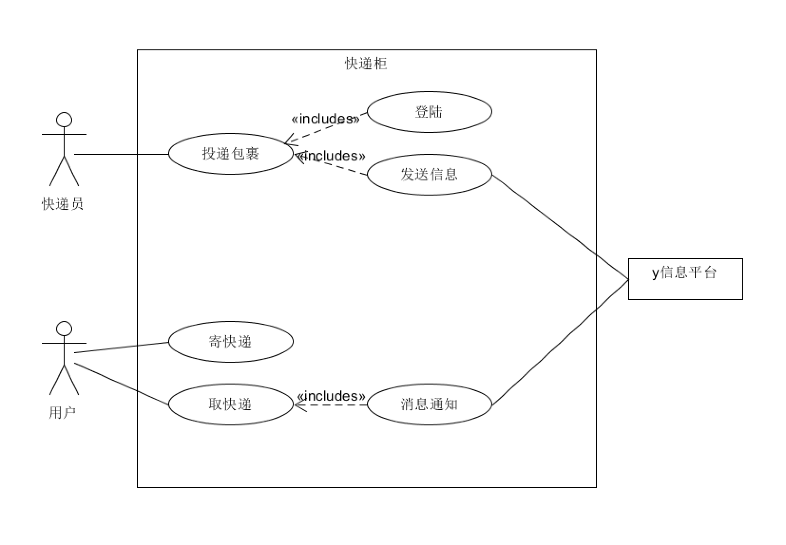

## HW5

#### 1. 根据订旅馆建模文档，[Asg-RH.pdf](<https://sysu-swsad.github.io/swad-guide/material/Asg_RH.pdf>)

##### 1.1 绘制用例图模型（到子用例）

订旅馆需要由以下部分组成：

* Find Hotel

  * Location Pinpoint

  * Choose Date
  * Choose Hotel
    * Price
    * Environment
    * Users Reviews

* Make Reservation

  * Choose Date
  * Choose Room Type
  * Confirm

* Pay

##### 1.2 给出 make reservation 用例的活动图

#### 2. 根据课程练习“投递员使用投递箱给收件人快递包裹”的业务场景

#### 2.1 分别用多泳道图建模三个场景的业务过程

* 场景1：x科技公司发明了投递柜，它们自建了投递柜以及远程控制系统。注册的投递员在推广期免费使用投递柜。由于缺乏资源，仅能使用y移动平台向客户发送短信通知。

  

* 场景2：随着产品推广，x公司与各大快递z公司达成协议。x公司在快递柜上添加了二维码扫描装置，z公司的快递员不仅可在快递柜上登陆（由z公司提供认证服务），且可扫描快递单号，投递入柜后自动由z公司发短信给客户。客户取件后，自动发送给z公司投递完成。

  

* 场景3: x公司进一步优化服务，开发了微信小程序实现扫码取快递。如果用户关注了该公司公众号，直接通过过公众号推送给用户取件码等信息。不再发送短信。

  

#### 2.2 根据上述流程，给出快递柜系统最终的用例图模型

- 用正常色彩表示第一个业务流程反映的用例

  

- 用绿色背景表述第二个业务场景添加或修改的用例，以及支持 Actor

  

- 用黄色背景表述第三个业务场景添加或修改的用例，以及支持 Actor

[back](./)

