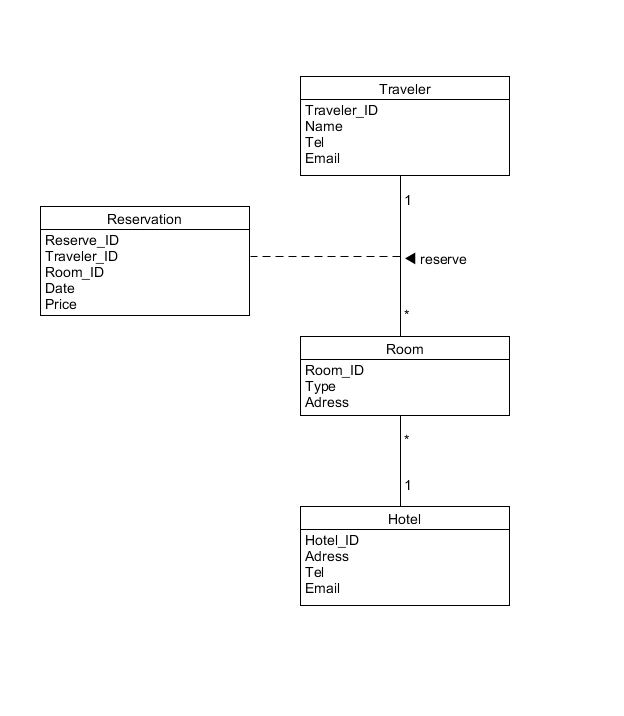
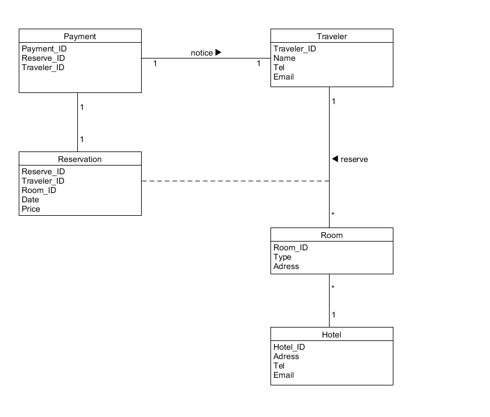
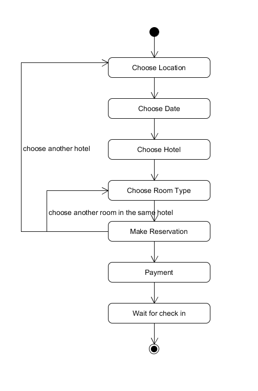

## HW6

#### 1. 使用类图，分别对 [Asg-RH.pdf](<https://sysu-swsad.github.io/swad-guide/material/Asg_RH.pdf>) 文档中 Make Reservation 用例以及 Payment 用例开展领域建模。然后，根据上述模型，给出建议的数据表以及主要字段，特别是主键和外键

- 注意事项：
  - 对象必须是名词、特别是技术名词、报表、描述类的处理；
  - 关联必须有多重性、部分有名称与导航方向
  - 属性要注意计算字段
- 数据建模，为了简化描述仅需要给出表清单，例如：
  - Hotel（ID/Key，Name，LoctionID/Fkey，Address…..）

##### 1.1 Make Reservation领域图

##### 1.2 Payment领域图

##### 1.3 数据表主要字段

- Reservation
  - Reserve_ID (primary key)
  - Traveler_ID (foreign key)
  - Room_ID (foreign key)
  - Date
  - Price
- Traveler
  - Traveler_ID (primary key)
  - Name
  - Tel
  - Email
- Hotel
  - Hotel_ID (primary key)
  - Tel
  - Address
  - Email
- Room
  - Room_ID (primary key)
  - Type
  - Address
- Payment
  - Payment_ID (primary key)
  - Reserve_ID (foreign key)
  - Traveler_ID (foreign key)

#### 2. 使用 UML State Model，对每个订单对象生命周期建模

- 建模对象： 参考 Asg_RH 文档， 对 Reservation/Order 对象建模。
- 建模要求： 参考练习不能提供足够信息帮助你对订单对象建模，请参考现在 定旅馆 的旅游网站，尽可能分析围绕订单发生的各种情况，直到订单通过销售事件（柜台销售）结束订单。

##### 2.1 Order/Reservation对象建模

[back](./)